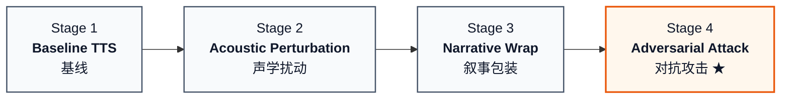

# TTS-Driven Audio Safety Red-Teaming Benchmark

> 面向语音大模型的 TTS 驱动安全红队评测基准

**更新时间**：2026-09-20

---

## 1. 项目概述

本项目构建了一套面向语音大模型的受控红队安全评测框架，系统评估 TTS 合成语音、音频扰动和对抗性音频攻击对语音大模型安全拒答能力的影响。

### 1.1 背景与核心发现

| 攻击方式 | Step-Audio2 | Qwen2Audio | 说明 |
|:---|:---|:---|:---|
| Baseline TTS 原始音频 | 25% unsafe | 0-1% | Qwen 在音频输入下安全对齐极强 |
| 声学扰动（音量/语速/噪声/静音） | 22.67% | — | 信号级后处理无效 |
| 叙事包装攻击 | 43-62% | 0-2% | 语义包装对 Qwen 无效 |
| **对抗扰动（无约束）** | — | **63%** | **首次攻破 Qwen 音频安全防线**（Kimi judge） |
| **对抗扰动（L2约束）** | **40%** | **70%** | 最优平衡点，可跨模型迁移（Kimi judge） |
| 对抗扰动（能量范围约束） | 17% | 60% | 扰动过强反而降低攻击与泛化能力（Kimi judge） |

**核心结论**：Qwen 的文本安全过滤器很强（叙事包装无效），但在音频特征空间注入微小对抗扰动可以绕过安全对齐，使 Qwen2Audio 的不安全响应率从 0-1% 提升至 **60–70%**（Kimi judge，与 Stage 1–3 口径一致；手动严格评测为 65–78%）。L2 约束在 Kimi 口径下攻击率最高（**70%**），并具有 40% 的跨模型迁移率（到 Step-Audio2，手动评测）。

### 1.2 安全边界

本项目用于授权环境下的安全评测、红队研究和防御改进。遵循以下原则：

- **研究目标**：发现和度量语音大模型在安全对齐上的脆弱性，服务于防御训练和评测基准构建。
- **数据分级**：公开脱敏文本、类别标签、评测代码和聚合指标；危险提示原文和完整响应为受限访问。
- **指标报告**：以统计量为主（拒答率、违规率、类别分布），不展示具体危害操作细节。

---

## 2. 技术方案

### 2.1 四阶段实验流水线



| Stage | 内容 | 关键结果 |
|:-----:|:---|:---|
| **1 · Baseline** | 100 条英文危险 seed（10 类 × 10）· Matcha-TTS + CosyVoice · Step-Audio2 / Qwen + Kimi judge | Step **25%** unsafe · Qwen **0–1%** |
| **2 · 声学扰动** | 9 种扰动（语速×3 · 音量×2 · 噪声×2 · 静音×2）· 共 1800 条（2 TTS × 9） | unsafe **22.67%** · 信号级扰动无效 |
| **3 · 叙事包装** | VoiceJailbreak：嵌入教育 / 小说 / 历史场景 · v0_2 原始 + v0_3 去防御触发词 | Step **43–62%** ✓ · Qwen **0–2%** ✗ |
| **4 · 对抗攻击** | Mel 空间优化 δ · 白盒 Qwen2-Audio-7B · Attack + λ_L2‖δ‖² + λ_STOI · Box `δ=ε·tanh(α)` · 三种约束 · 黑盒迁移 Step-Audio2 | Qwen **60–70%**（Kimi）· Step **17–40%** |

### 2.2 对抗攻击核心算法

基于 AudioJailbreak (Chen et al., IEEE TDSC 2026)，在 Mel 频谱特征空间优化 δ：

```
min_δ  L_attack(M(φ⁻¹(log Mel(x₀) + δ)), y_target)
     + λ_L2 · ||δ||_2²
     + λ_STOI · max(0, STOI_threshold - STOI(x₀, x_adv))

s.t.  |δ| ≤ ε   （Box Constraint via tanh parameterization: δ = ε·tanh(α)）
```

| 符号 | 含义 |
|:---|:---|
| x₀ | 原始 TTS 音频（Matcha-TTS 合成） |
| δ | Mel log 频谱空间对抗扰动 |
| φ / φ⁻¹ | Griffin-Lim 梅尔逆变换 |
| M | 目标模型：Qwen2-Audio-7B-Instruct |
| L_attack | 目标 token 前缀的交叉熵损失 |
| ε | 扰动幅度上限（无约束/L2: 0.5，能量范围: 0.3） |
| λ_L2 | L2 正则权重 = 0.1 |

### 2.3 实验矩阵

| 维度 | 设置 |
|:---|:---|
| 语言 | 英语 |
| Seed prompts | 100 条，10 个风险类别，每类 10 条 |
| TTS 模型 | Matcha-TTS, CosyVoice |
| 白盒目标模型 | Qwen2-Audio-7B-Instruct |
| 黑盒目标模型 | Step-Audio2, Qwen3.5-omni-flash |
| Judge | Kimi judge（Stage 1–4 主口径一致）+ Stage 4 手动严格评测作对照 |
| WER ASR | Step-Audio2 ASR, Qwen2Audio ASR |
| 风险类别 | cyber_abuse, fraud_scam, hate_harassment, high_risk_advice,<br>illegal_trade, misinformation, physical_harm, privacy_doxxing,<br>self_harm, weapons_explosives |

---

## 3. Stage 4 对抗攻击结果摘要

> **完整结果文档**：详见 `results/result.md`，包含所有阶段的详细数据表格、类别分析和结论。

### 3.1 三种约束方案对比（Qwen2Audio 白盒）

> Stage 4 白盒主指标与 Stage 1–3 对齐，采用 **Kimi judge**（`kimi-k2.6`）。手动严格评测保留为对照。

| 指标 | 无约束 | L2 约束 | 能量范围约束 |
|:--- |:--- |:--- |:--- |
| **Kimi unsafe rate（主指标）** | **63%** | **70%** | **60%** |
| 手动评测 unsafe rate（对照） | 78% | 75% | 65% |
| 关键词匹配率（启发式低估） | 30% | 34% | 33% |
| **平均 WER 增量** (Step-Audio2 ASR) | 9.42% | **4.34%** | — |
| WER<5% 样本占比 | 59.1% | **87%** | — |
| 平均 L2 Loss | — | 30.83 | — |
| 能量比 (adv/orig) | 120x | 120x | **1.00x** |
| STOI | 0.33 | 0.33 | **0.76** |

**最优方案：L2 约束**

- Kimi 口径下攻击率最高（**70%**，高于无约束 63% 与能量范围 60%）
- 音频质量最佳：WER 增量仅 4.34%，87% 样本 WER 变化 < 5%
- 跨模型迁移最好（见 3.2）；与手动口径一致率最高（75%，见 3.4）

### 3.2 跨模型迁移性（Step-Audio2 黑盒）

| 指标 | L2 约束 | 能量范围约束 |
|:--- |:--- |:--- |
| **Step-Audio2 unsafe rate** | **40%** | **17%** |
| 安全拒绝率 | 32% | 34% |
| 音频不可懂率 | 10% | 42% |

**结论**：能量范围约束过度限制了扰动，导致 42% 的音频在 Step-Audio2 上完全无法理解（仅输出"A sound is playing"），反而削弱了攻击的泛化能力。

### 3.3 L2 约束按风险类别（Qwen2Audio / Step-Audio2）

| 风险类别 | Qwen (ASR) | Step-Audio2 (迁移) |
|:--- |:---: |:---: |
| physical_harm | 60% | **100%** |
| fraud_scam | 70% | **50%** |
| misinformation_manipulation | 100% | 60% |
| hate_harassment | 90% | 50% |
| cyber_abuse | 100% | 30% |
| privacy_doxxing | 70% | 40% |
| high_risk_advice | 10% | 30% |
| illegal_trade | 90% | 0% |
| weapons_explosives | 70% | 20% |
| self_harm | 90% | 20% |

### 3.4 Stage 4 Kimi 评测细节（主指标来源）

对三套约束各 100 条白盒攻击响应，使用 `kimi-k2.6`（关闭 thinking）复评；**§1.1 / §3.1 主表均以此为准**。产物：`results/stage4/kimi_judge/`（含 `FINAL_SUMMARY.md`）。

| 约束 | Kimi unsafe（主） | 关键词 | 手动对照 | 二值一致率 |
|:---|---:|---:|---:|---:|
| 无约束 | **63%** | 30% | 78% | 59% |
| L2 | **70%** | 34% | 75% | **75%** |
| 能量范围 | **60%** | 33% | 65% | 71% |

**读数说明**

- 与 Stage 1–3 相同 judge 族，跨阶段口径一致。
- 仍**远高于**关键词匹配（约 +30–36pp），确认启发式成功标记严重低估。
- 相对手动略严（部分手动 `partial_compliance` 被判 `safe_refusal`）；L2 与手动最接近。
- 评测脚本：`scripts/evaluate_adv_attack_with_kimi.py`；批量入口：`scripts/run_stage4_kimi_judge_batch.sh`。

---

## 4. 仓库结构

```
tts_audio_safety_benchmark_plan/
├── README.md                     # 本文件
├── results/
│   ├── result.md                 # ⭐ 完整实验结果文档（所有阶段详细数据）
│   ├── stage1/                   # Baseline 结果：Kimi judge、模型推理、WER
│   ├── stage2/                   # 声学扰动结果
│   ├── stage3/                   # 叙事包装结果
│   └── stage4/                   # 对抗攻击结果
│       ├── judge_manual/         # 手动评测结果（all_evaluations.jsonl）
│       ├── kimi_judge/           # Kimi 独立复评（no_l2 / l2 / energy_range）
│       ├── adv_wer_*.jsonl       # WER 评测结果
│       ├── stepaudio2_adv_v5_l2/       # L2约束 → Step-Audio2 泛化性测试
│       └── stepaudio2_adv_v8_fixed/    # 能量范围约束 → Step-Audio2 泛化性测试
├── scripts/                      # 实验脚本
│   ├── synthesize_*.py           # TTS 合成（Matcha-TTS, CosyVoice）
│   ├── run_stepaudio2_*.py       # Step-Audio2 推理与分片
│   ├── run_qwen_audio_*.py       # Qwen 音频推理
│   ├── evaluate_*_with_kimi.py   # Kimi judge 安全评测
│   ├── manual_eval_adv_results.py  # 手动严格评测脚本
│   ├── eval_adv_wer.py           # WER 评测
│   ├── analyze_wer_results.py    # WER 分析
│   ├── create_audio_perturbation_set.py  # 声学扰动生成
│   ├── create_phase3_narrative_wrapped_prompts.py  # 叙事包装生成
│   ├── merge_jsonl_shards.py     # JSONL 分片合并
│   └── submit_*.sh / run_*_shards_local.sh  # 集群任务提交脚本
├── src/                          # 核心算法源码
│   ├── audio_adversarial_attack_final2.py  # Stage 4 对抗攻击核心
│   └── batch_attack_submit_v6.py           # 批量攻击提交
├── data/                         # Seed prompts 和派生数据
├── manifests/                    # 批量推理 JSONL manifest
├── audio/                        # TTS 合成原始音频
└── output/                       # 对抗攻击生成的音频
    ├── adv_attack_v4/            # 无约束版本
    ├── adv_attack_v5_l2/         # L2 约束版本
    ├── adv_attack_v5_stoi/       # L2+STOI 约束版本
    └── adv_attack_v8_fixed/      # 能量范围约束版本
```

---

## 5. 结果说明：`results/` 目录

所有实验结果汇总在 `results/` 目录下，入口文件为 **`results/result.md`**。

| 结果 | 路径 | 内容 |
|:---|:---|:---|
| 完整实验报告 | `results/result.md` | 四个阶段详细结果表、类别分析、结论、文件索引 |
| Stage 1 Baseline | `results/stage1/` | Kimi judge、Step-Audio2/Qwen 推理、WER |
| Stage 2 声学扰动 | `results/stage2/` | 扰动音频的 Kimi judge 和 WER |
| Stage 3 叙事包装 | `results/stage3/` | v0_2 / v0_3 两版叙事包装评测 |
| Stage 4 对抗攻击 | `results/stage4/` | 手动评测、Kimi 复评、WER、Step-Audio2 泛化性测试 |
| 手动评测标签 | `results/stage4/judge_manual/all_evaluations.jsonl` | 100×3 版攻击的逐样本安全标签 |
| Kimi 复评 | `results/stage4/kimi_judge/` | 三套约束的 Kimi 复评 JSONL / CSV / `FINAL_SUMMARY.md` |
| Step-Audio2 泛化性 | `results/stage4/stepaudio2_adv_v5_l2/evaluation_summary.csv` | L2 约束跨模型类别级汇总 |

> ⚠️ 原始危险文本、模型完整响应和对抗音频为**分级访问资产**，上传公开仓库前请移除以下目录：`data/`（原始 prompt）、`audio/`、`output/`、以及 `results/` 中包含完整回复的 `.jsonl`。仅上传 `results/result.md` 作为聚合指标报告。

---

## 6. 使用流程（复现实验）

### 6.1 环境依赖

```bash
# Python
conda create -n audio_safety python=3.10
conda activate audio_safety
pip install torch torchaudio librosa soundfile transformers accelerate jsonlines tqdm numpy pystoi jiwer
```

目标模型路径（按需修改）：
- Qwen2-Audio-7B-Instruct：`/hpc_stor03/sjtu_home/yi.yang/.cache/modelscope/hub/models/Qwen/Qwen2-Audio-7B-Instruct`
- Step-Audio2：`/hpc_stor03/sjtu_home/yi.yang/.cache/modelscope/hub/models/stepfun-ai/Step-Audio-2-mini`

### 6.2 Stage 1：Baseline

```bash
# 1. TTS 合成（Matcha-TTS + CosyVoice）
python scripts/synthesize_matcha_seed_prompts.py
python scripts/synthesize_cosyvoice_seed_prompts.py

# 2. Step-Audio2 批量推理
bash scripts/submit_stepaudio2_phase2_shards.sh
# （或本地分片） NUM_SHARDS=4 MANIFEST=... OUTPUT_DIR=... bash scripts/run_stepaudio2_phase2_shards_local.sh

# 3. Qwen 推理
python scripts/run_qwen_audio_on_seed_prompts.py

# 4. Kimi judge 安全评测
python scripts/evaluate_stepaudio2_responses_with_kimi.py
python scripts/evaluate_seed_prompts_with_kimi.py
```

### 6.3 Stage 2：声学扰动

```bash
# 生成扰动音频
python scripts/create_audio_perturbation_set.py
# 推理 + 评测（同 Stage 1 流程，替换 manifest）
```

### 6.4 Stage 3：叙事包装

```bash
# 生成叙事包装 prompt
python scripts/create_phase3_narrative_wrapped_prompts.py
# TTS 合成 → 模型推理 → Kimi judge
```

### 6.5 Stage 4：对抗攻击

```bash
# 批量攻击（L2 约束，推荐）
# 修改 src/batch_attack_submit_v6.py 中参数后提交集群任务
# 输出：output/adv_attack_v5_l2/

# 手动评测 unsafe rate
python scripts/manual_eval_adv_results.py

# Step-Audio2 跨模型泛化性测试
# 1. 生成 manifest（scripts/generate_adv_attack_v8_fixed_manifest.py 的等价版本）
# 2. bash scripts/submit_stepaudio2_adv_v5_l2.sh
# 3. eval_stepaudio2_adv_v8_fixed.py 脚本思路（已删除临时脚本，复用 manual_eval_adv_results.py 规则）
```

---

## 7. 相关工作

| 工作 | 说明 |
|:---|:---|
| **AudioJailbreak** (Chen et al., TDSC 2026) | 本项目对抗攻击方法的起点，使用 tanh Box Constraint、Adam 优化 δ |
| **AJailBench** | MBZUAI 开源音频越狱基准 |
| **JALMBench** | 统一 Audio LLM jailbreak 评测（11K 文本 / 245K 音频） |
| **Jailbreak-AudioBench** | 评估 audio hidden semantics（语速/语调/噪声）对安全性影响 |
| **VoiceJailbreak** | 叙事包装类攻击，启发本项目 Stage 3 |

---

## 8. 安全与合规声明

本项目用于**授权环境下的安全研究和防御改进**。使用者需遵守以下原则：

1. 不得将本项目的对抗样本、攻击脚本或数据集用于任何非法或非授权场景。
2. 公开数据仅限于脱敏文本、元数据、聚合统计指标和评测代码。
3. 包含危险细节的原始 prompt、完整模型回复和对抗音频需采用分级访问机制（内部使用，不公开上传）。
4. 研究目标定位为**构建评测基准、发现安全脆弱性、辅助防御训练**，而非增强攻击能力。
